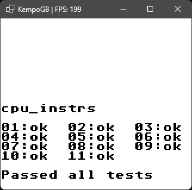
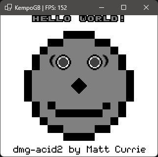

# KempoGB
A DMG Gameboy Emulator written in C#, Just for fun!

### Controls
```
Start  -  Enter, V
Select -  Space, C
Up     -  Up Arrow, W
Down   -  Down Arrow, S
Left   -  Left Arrow, A
Right  -  Right Arrow, D
A      -  Z, J
B      -  K, X
```

### Features
- Saving
- Loading
- Scanline PPU
- Fully Working Instruction Set
- Save States (PLANNED)
- Sound (needs improvement)

### Test Rom Results
#### Blargg's test roms


#### dmg_acid2


#### Playing a game (Pokemon Blue)


### Known Issues
- Some visual effects don't work properly, eg: 
  - The logo appearing on Link's Awakening
- The audio crackles quite badly if enabled
- Some Cartridge Types are unsupported: 
  - MBC2
  - MBC4
  - MBC5
  - MBC6
  - MBC7
  - MMM01
  - M161
  - HHuC1
  - HuC-3

### Credits
Thank you to 7thSamurai whose audio implementation HEAVILY inspired mine.
https://github.com/7thSamurai/Azayaka/tree/master
